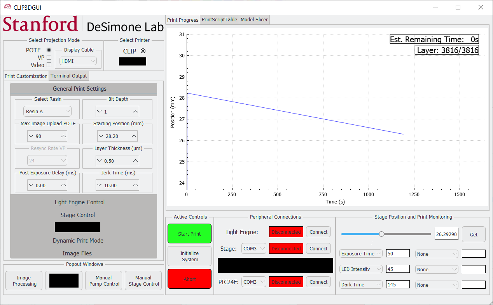
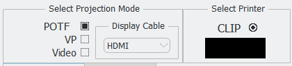
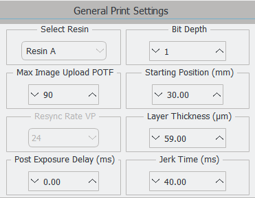
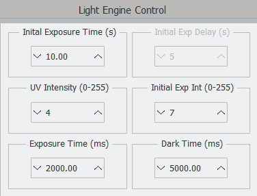
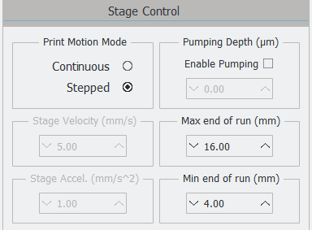
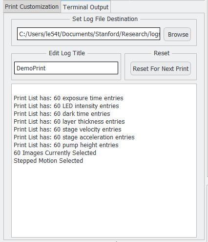
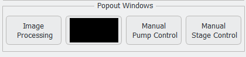
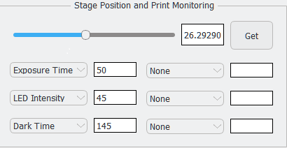
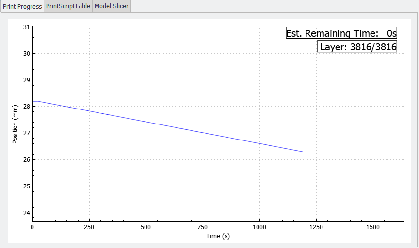

==============
User Interface
==============

Some features of the user interface are currently confidential while awaiting the 
publication of the relevant research. All print parameters, image files, and print scripts 
are stored when the GUI is closed and upon restart the GUI will initialize with the previous 
stored parameters.

Print Customization
---------------------------

The print customization window determines high level print features. See
Features->Print Modes to learn more.

**Select Projection Mode:**
Select between Pattern On The Fly (POTF), Video Pattern and Video mode. The printer will always initialize in
POTF mode and the light engine must be connected to properly switch projection modes. The display cable in use 
must also be selected, the two options being HDMI or DisplayPort.

**Select Printer:**
Select between a standard CLIP printer and other printers.

General Print Settings
---------------------------

	
**Select Resin:**
Select which resin you are currently printing with. Currently this has no
effect on the print and is only stored in the print log for future reference.
Double click to edit the text field or select from a list of previously used resins.

**Bit Depth:**
Select the bit depth of your input images, the default is 1-bit
binary images. The bit depth determines how many bits the intensity of a given pixel can occupy.
Increasing the bit depth allows for more granular and detailed control of a given pixel intensity,
while also increasing the file size of a given image. In POTF mode increasing the bit depth will 
increase reupload times significantly while also lowering the max image upload. In Video Pattern 
mode every given bit depth requires separate image processing, see the Image Processing page for
more details.

A pixel with a bit depth of 1 is binary and can only be 0 or 1 corresponding to on or off. 
A pixel with bit depth 4 can have values ranging from 0000 to 1111 (0-15 in decimal) and a pixel 
with bit depth 8 can have values ranging from 0000 0000 to 1111 1111 (0-255 in decimal). 
The intensities for non-binary images(bit depth > 1) are applied after the set LED intensity. For a given pixel in a 
8 bit depth image where the LED intensity is set to 60 and the pixel intensity is 85 the resulting intensity of that
pixel will be 60 * (85/255) = 20.

**Max Image Upload:**
Determines the max number of images to upload at one time when in POTF mode, will only affect POTF mode.
With 1-bit images this caps out at 400 images, with 8-bit images this caps out at 50 images 
(can be calculated as 400/bit depth). User may want to keep the max image upload low
to avoid print discontinuities caused by long upload times.

**Resync Rate VP:**
The Resync Rate determines the rate of resyncs in Video Pattern mode. These resyncs are required to ensure 
that there is no timer drift between the light engine and the stage. In non-dynamic prints this resync will 
take ~1 ms, and in dynamic prints longer resyncs on the edges between changes in light engine parameters.

**Starting Position(mm):**
Determines the starting position of the print, this value should be at roughly the deadzone thickness 
away from the window and within the focal plane of the light engine optics. Any movement relative to this value will be negative and 
with each layer the stage will move towards 0. This parameter will change depending on what optics 
are used and the resin vat design. 

**Layer Thickness(um):**
Determines the layer thickness of the print. If set to 10 um each image file will result
in a 10um thick layer. Increasing the layer thickness will increase the print speed, but will
result in worse surface finishes, staircasing and small features may be harder to resolve.

**Post Exposure Delay(ms):**
A delay between the end of a given layer exposure and stage movement. When this parameter is set to 0,
the stage will move as soon as the exposure ends. Due to the lifetime of a free radical being in the low ms range, 
the polymerization may still be in effect several ms after the exposure ends. This delay may be required for prints 
with small features.

**Jerk Time (ms):**
Jerk is the derivate of acceleration and the jerk time will determine how long it takes the stage to reach
the desired stage acceleration. If the jerk time is too low the stage will not have time to move the required
distance between layers. Generally the minimum jerk time required can be calculated as the Dark Time/4.

Light Engine Control
---------------------------

**Initial Exposure Time(s):**
The initial exposure time determines the exposure time for the first layer
of the print. This allows the print to properly adhere to the build platform.
No stage movements are performed during the initial exposure.

**Initial Exposure Delay(s):**
A delay between the end of initial exposure and the start of the rest of the print.
This delay may be required for long or high intensity initial exposures which can 
cause the deadzone to temporarily shrink which can cause print defects early in the print.

**UV Intensity(0-255):**
Determines the intensity of the UV LEDs in the light engine (ranges from 0-255) 
where 0 = 0% LED duty cycle and 255 = 100% LED duty cycle.

**Initial Exposure Intensity(0-255):**
The initial exposure intensity determines the UV intensity for the initial exposure.
This parameter may vary depending on how well a given resin adheres to the build platform.
See UV Intensity for more details.

**Exposure Time:**
Determines how long the light engine will expose for each layer of the print. The stage will 
not move during the exposure time, except for when in continuous print mode. 

**Dark time:**
Determines the time between exposures, dark time is used for stage movement and timing overhead.
Increasing the dark time will give the resin more time to reflow thereby reducing the suction forces 
on the part during the print.

Stage Control
---------------------------

	
**Print Motion Mode:**
Selects between stepped or continuous motion mode. In continuous mode the stage is
constantly in motion and in stepped mode the stage movement is paused during exposure.
Stepped motion is generally preferred, the pause in the print process allows for resin 
reflow and relieve stresses on the printed parts.

**Pumping Depth:**
Pumping is an exaggerated stage movement between layers to promote resin reflow and 
avoid elastic parts sticking to the build window or deadzone. Used for elastic materials 
such as EPU.

**Stage Velocity:**
Determines the velocity of the stage. Generally does not have an active effect on the 
print unless set below 1 mm/s.

**Stage Acceleration:** 
Determines the acceleration of the stage. Does not have an active effect on the print 
unless set below 2 mm/s^2.

**Max End of Run:**
Determines the upper limit of stage movement, this value should be set to be the same 
height as the build window to avoid damaging the window.

**Min End of Run:**
Determines the lower limit of stage movement. Default is set to 0, changing this variable is not reccommended 
unless you are printing object with heights greater than max end of run.

Image Files
------------------------
.. figure:: images/ui-image-files.PNG
    :align: right
    :figwidth: 300px
	
Object image files are selected here. Make sure your image files are located in the same file directory 
and sorted numerically. Image files must be bitmapped images, if using video pattern mode the images 
must be processed using the image processing window (see Image Processing page for more).

|
|
|
|

Terminal Output
-------------------

**Log File Destination:**
Determines the directory where the log file will be stored.

**Edit Log Title:**
Set the Log Title to record what you are printing. The saved log title will also include 
a timestamp of when the print was started.

**Reset:**
Resets the software after a completed print, parameters from the past print will be stored.
To start a new print after resetting, initialize and start the print!

**Terminal Output:**
The terminal output provides a live readout of every operation performed by the software. This provides the user with insight
into the inner workings of the GUI and a valuable debug readout. Upon print completion or abort the terminal output is stored in a .txt
log with a timestamp for that print.

Active Controls
---------------------------
.. figure:: images/ui-active-control.png
    :align: right
    :figwidth: 300px

**Start Print:**
Starts the prints, must be preceded by Initialize and Synchronize and the stage must be at the correct starting position.

**Initialize and Synchronize:**
Prepares the system for your print based on your print settings and parameters. Will prompt the user to verify the print parameters
and settings. Once initialization has completed and the stage has reached the correct starting position, the print can now be started.

**Abort:**
The abort button acts as an emergency stop, click abort if something is going wrong with your print.

Peripheral Connections
---------------------------
.. figure:: images/ui-peripheral-connections.PNG
    :align: right
    :figwidth: 300px

**Light Engine:**
The light engine connects though USB HID. Click connect, if connection was succesful it should display the last error code
(usually 0), if it fails it will display "Light Engine Connection Failed" in which it failed outright or "Failed to get last error code"
in which the connection was succesful but communication is not work (in this case restart the light engine).

**Stage:**
The stage connects through RS232 serial. Select the correct COM port and click connect. To validate stage connection get the last stage position
and verify that a value is displayed.

**Pump:**
The pump connects in a similar manner to the stage. Select the correct COM port and click connect.

Popout Windows
---------------------------

**Image Processing:**
Open the image processing pop-up window. See Features->Image Processing to learn more.

**Manual Pump Control:**
Opens the manual pump control pop-up window. See Features->Manual Controls->Manual Pump Controls to learn more.

**Manual Stage Control:**
Opens the manual stage control pop-up window. See Features->Manual Controls->Manual Pump Controls to learn more.

Stage Position and Print Monitoring
------------------------------------

**Stage Position:**
The current stage position is displayed with a slider and indicator in units of mm.
It is continuously updating during the initialization and print process, the user can also
use the Get button to poll the stage for it's current position. 

**Print Monitoring:**
There are 6 possible live values from the print that can be displayed to provide the user with feedback
on which print parameters are being used or to monitor sensor inputs. Currently this is used to display
print parameters that are handled by the print script when in dynamic print mode.

Graphics Window
-----------------
The graphics window displays a graph of stage position vs. time updated throughout the print. 
It also displays the current layer of the print and the estimated remaining print time. 

**Print Script:**
The print script is used to dynamically control print variables on a layer by layer basis. Print scripts should be in the format of
.txt or .csv files where each row number represents the layer number, see Dynamic Print Controls for more.